# Non-Profit Intelligence Scraper


---

## Executive Summary: Data Intelligence vs. Simple Scraping

Most scraping tools answer the question *"What is on this page?"*. This system answers a fundamentally different and more valuable question: **"Which of these organizations should my sales team call, and exactly why?"**

| Dimension | Simple Scraping | Data Intelligence (This System) |
|---|---|---|
| **Output** | Raw HTML / strings | Validated, typed business objects |
| **Signal** | Page content | Qualified sales leads with scores |
| **Decision Support** | None | Sector classification + outreach trigger |
| **Quality Control** | None | Pydantic schema validation + AI review |
| **Scalability** | Fragile, sync | Async concurrency with semaphore control |
| **Integration Ready** | No | JSON export + PostgreSQL persistence |

A raw directory listing tells you an NGO exists. This pipeline tells you **it's a Healthcare NGO with 200+ staff, recently launched a digital transformation initiative, and is likely receptive to outreach about data management tooling — score: 8/10**. That is the difference between data and intelligence.

---

## Technology Stack

| Layer | Technology | Purpose |
|---|---|---|
| **Runtime** | Python 3.11+ | Core language, async event loop |
| **Browser Automation** | Playwright (Async API) | Stealth, JS-rendered page scraping |
| **AI Engine** | Google Gemini 1.5 Flash | Text parsing, scoring, outreach reasoning |
| **Financial Enrichment** | ProPublica Nonprofit Explorer (IRS 990) | Revenue/assets enrichment by EIN |
| **Data Validation** | Pydantic v2 | Schema enforcement, type coercion |
| **Persistence (Optional)** | PostgreSQL + asyncpg | Structured lead storage |
| **Output** | JSON (structured) | Pipeline-agnostic data export |
| **Configuration** | python-dotenv | 12-Factor App environment management |

---

## Project Structure

```
nonprofit-intel-scraper/
├── scraper.py          # NonProfitScraper — stealth async browser engine
├── processor.py        # LeadQualifyingEngine — Gemini AI intelligence layer
├── main.py             # Async orchestrator — pipeline entry point
├── requirements.txt    # Pinned dependencies
├── .env.example        # Environment variable template
└── output/             # Auto-created — stores JSON exports
```

---

## Getting Started

### 1. Prerequisites

```bash
python --version   # Requires 3.11+
pip install -r requirements.txt
playwright install chromium
```

### 2. Environment Setup

Copy the template and fill in your credentials:

```bash
cp .env.example .env
```

Open `.env` and configure:

| Variable | Required | Description |
|---|---|---|
| `GEMINI_API_KEY` | **Yes** | Your Google AI Studio API key |
| `SCRAPER_MAX_PAGES` | No | Number of directory pages to scrape (default: `3`) |
| `SCRAPER_CONCURRENCY` | No | Max parallel browser contexts (default: `4`) |
| `MIN_LEAD_SCORE` | No | Minimum AI score to include in output (default: `4`) |
| `ENRICH_WITH_IRS990` | No | Enable/disable IRS 990 enrichment stage (`1`/`0`, default: `1`) |
| `ENRICH_CONCURRENCY` | No | Parallel enrichment requests for IRS 990 lookups (default: `8`) |
| `PRIORITY_TARGET_SECTORS` | No | Comma-separated sectors that receive prioritization bonus |
| `OUTPUT_DIR` | No | Directory for JSON exports (default: `output/`) |
| `POSTGRES_DSN` | No | PostgreSQL connection string for DB export |
| `CUSTOM_TARGET_URLS` | No | Comma-separated list of specific NGO page URLs to target |

### 3. Run the Pipeline

```bash
python main.py
```

The pipeline will:
1. Launch async stealth browser sessions
2. Scrape NGO directory pages concurrently
3. Pass raw data through the Gemini AI engine
4. Validate and score each lead
5. Enrich leads with IRS 990 financials (when EIN is available)
6. Compute commercial prioritization score + budget tier
7. Export results to `output/qualified_leads_<timestamp>.json`
8. Print a formatted terminal summary of prioritized leads

### 4. Custom URL Targeting

To scrape specific organization pages instead of the default directory:

```bash
# In .env
CUSTOM_TARGET_URLS=https://www.ngoadvisor.net/ong/doctors-without-borders/,https://www.ngoadvisor.net/ong/oxfam/
```

---

## Output Format

Each entry in the `qualified_leads` array follows this schema:

```json
{
  "organization_name": "Médecins Sans Frontières (MSF)",
  "mission_statement": "Provides emergency medical aid to populations affected by conflict, epidemics, disasters, or exclusion from healthcare.",
  "target_sector": "Healthcare",
  "lead_score": 9,
  "outreach_trigger": "MSF operates across 70+ countries with complex logistics data flows; recent expansion into digital health records creates an immediate opportunity to propose data integration and analytics solutions.",
  "source_url": "https://www.ngoadvisor.net/ong/msf/",
  "website": "https://www.msf.org",
  "ein": "123456789",
  "annual_revenue_usd": 72873511,
  "total_assets_usd": 132990857,
  "financial_year": 2023,
  "financial_data_source": "IRS 990 (ProPublica Nonprofit Explorer)",
  "financial_summary": "Annual revenue: $72,873,511; Total assets: $132,990,857; IRS tax year: 2023; Source: IRS 990 (ProPublica Nonprofit Explorer)",
  "budget_tier": "Enterprise",
  "prioritization_score": 13.3
}
```

### Prioritization Logic

Leads are sorted by a commercial `prioritization_score` that combines:

- AI `lead_score` (1-10)
- Revenue tier bonus (from IRS 990)
- Asset strength bonus (from IRS 990)
- Target sector fit bonus (`PRIORITY_TARGET_SECTORS`)
- Presence of verified financial summary

This means the final top leads are ordered for outreach impact, not only by generic AI score.

---

## Lead Scoring Algorithm

The `lead_score` field (integer, 1–10) is computed by Gemini 1.5 Flash using a **multi-criteria heuristic scoring model**. The model is instructed to evaluate six independent sub-dimensions and sum their scores, capped at 10.

### Scoring Formula

$$S_{lead} = \min\left(10,\ \sum_{i=1}^{6} w_i \cdot s_i\right)$$

Where each $s_i$ is a sub-score from the following rubric:

| Dimension $i$ | Signal Detected In | Max Points $w_i \cdot s_i$ |
|---|---|---|
| **Organizational Scale** | Staff mentions, budget figures, global/national reach | 3 |
| **Technology Affinity** | Digital tools, automation, data, software mentions | 2 |
| **Growth / Urgency** | Program expansion, new initiatives, recent milestones | 2 |
| **Sector Premium** | Healthcare, Education, Environment, Humanitarian | 1 |
| **Contact Availability** | Website URL + contact info present | 1 |
| **Mission Clarity** | Well-defined, specific vs. vague or generic | 1 |

### Score Interpretation

| Score Range | Qualification Tier | Recommended Action |
|---|---|---|
| `9 – 10` | **Tier 1 — Hot Lead** | Immediate outreach, personalized pitch |
| `7 – 8` | **Tier 2 — Warm Lead** | Queue for weekly outreach cycle |
| `5 – 6` | **Tier 3 — Qualified** | Include in drip campaign |
| `3 – 4` | **Tier 4 — Marginal** | Monitor, re-evaluate quarterly |
| `1 – 2` | **Tier 5 — Unqualified** | Discard or archive |

### Why Heuristic AI Scoring Over Rule-Based Scoring

Traditional keyword-matching scorers are brittle: they break when descriptions change phrasing and have no semantic understanding. By delegating scoring to Gemini 1.5 Flash with a structured rubric prompt, the system gains:

- **Semantic comprehension**: "provides clean water to underserved villages" → scores high on Humanitarian sector even without exact keyword matches.
- **Context-awareness**: The model can infer organizational scale from indirect signals (e.g., "200 field offices" implies scale without the word "large").
- **Dynamic outreach reasoning**: The `outreach_trigger` field is generated contextually from the mission, not from a lookup table — making every trigger unique and actionable.

---

## Architecture Overview

### Mermaid Diagram (TD)

```mermaid
%%{init: {'flowchart': {'curve': 'basis', 'nodeSpacing': 45, 'rankSpacing': 80, 'htmlLabels': true}} }%%
graph TD
  A[Target Selection<br/>Charity Navigator URLs<br/>NGO Advisor URLs]

  subgraph C["Collection Layer "]
    B1[Playwright Async Crawler]
    B2[User-Agent Rotation]
    B3[Semaphore Concurrency Control]
  end

  CollectionOut[ ]
  CollectionOut:::hidden

  subgraph I["Intelligence Layer "]
    D1[Gemini 1.5 Flash]
    D2[Raw HTML Parsing]
    D3[Structured Intelligence<br/>Mission and Sector]
    D4[AI Relevance Score]
  end

  IntelligenceOut[ ]
  IntelligenceOut:::hidden

  subgraph E["Financial Enrichment Layer "]
    F1[EIN Extraction]
    F2[ProPublica and IRS 990 API Lookup]
    F3[Revenue and Assets Enrichment]
    F4[Financial Tier Classification]
  end

  P0[Score Fusion<br/>AI + Financial Signals]
  G[Prioritization Engine<br/>Heuristic Scoring]
  H1[Output Layer<br/>Validated JSON via Pydantic]
  H2[(PostgreSQL Persistence)]

  A --> B1 --> B2 --> B3
  B3 --> CollectionOut
  CollectionOut --> D1
  D1 --> D2 --> D3 --> D4
  D4 --> IntelligenceOut
  IntelligenceOut --> F1 --> F2 --> F3 --> F4
  F4 --> P0
  D4 --> P0
  P0 --> G
  G --> H1 --> H2

  classDef source fill:#EAF2FF,stroke:#1D4ED8,color:#0B1F44,stroke-width:1.5px;
  classDef collection fill:#E6FFFA,stroke:#0F766E,color:#083344,stroke-width:1.5px;
  classDef intelligence fill:#FFF7E6,stroke:#B45309,color:#7C2D12,stroke-width:1.5px;
  classDef enrichment fill:#ECFDF3,stroke:#15803D,color:#14532D,stroke-width:1.5px;
  classDef prioritize fill:#F5F3FF,stroke:#6D28D9,color:#3B0764,stroke-width:1.5px;
  classDef output fill:#EFF6FF,stroke:#1E40AF,color:#1E3A8A,stroke-width:1.5px;
  classDef storage fill:#F3F4F6,stroke:#374151,color:#111827,stroke-width:1.5px;
  classDef hidden display:none;

  class A source;
  class B1,B2,B3 collection;
  class D1,D2,D3,D4 intelligence;
  class F1,F2,F3,F4 enrichment;
  class P0,G prioritize;
  class H1 output;
  class CollectionOut,IntelligenceOut hidden;
```


  class H2 storage;
```

- `main.py`: Async orchestrator and pipeline entrypoint.
- `scraper.py`: Stealth collection engine (Playwright async, user-agent rotation, semaphore control, deduplication).
- `processor.py`: AI intelligence layer (Gemini parsing, scoring, validation, retries).
- Financial enrichment stage: EIN extraction, IRS 990 lookup, revenue/assets normalization, budget tier assignment.
- Export stage: Pydantic-validated JSON output and optional PostgreSQL upsert.

---

## Contributing

Pull requests are welcome. For major changes, open an issue first to discuss what you would like to change. Ensure all code passes type checking with `mypy` and follows PEP 8 naming conventions.

---

## License

[MIT](LICENSE)
